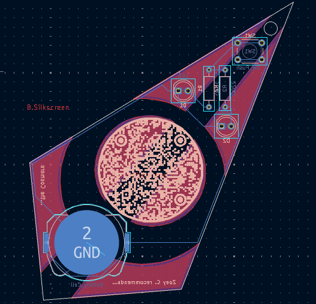

# PCB badge for Fallout

## Features (if it can even be called that)

- Two LED lights that glow when button is pressed
- QR code to the coppermind
- My name (Zoey C.)

## Picture of PCB

## Inspiration

One of my favourite fandoms is the Cosmere, and the fan wiki for it is called the coppermind (named after the fact that feruchemic copper can be used to store information on Scadrial), and PCBs have copper, so I used exposed copper to make the coppermind's symbol.
